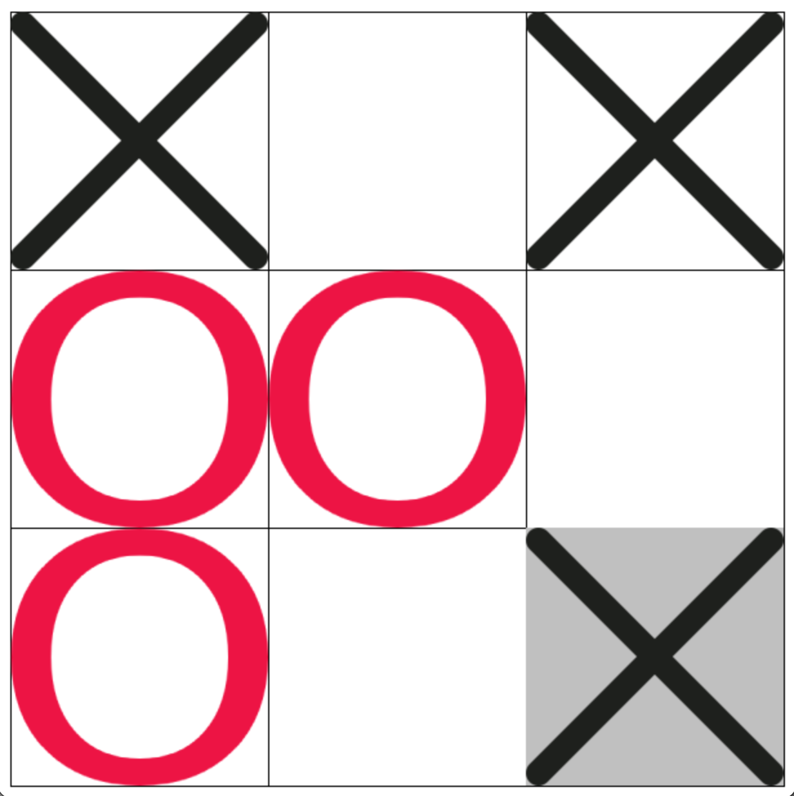
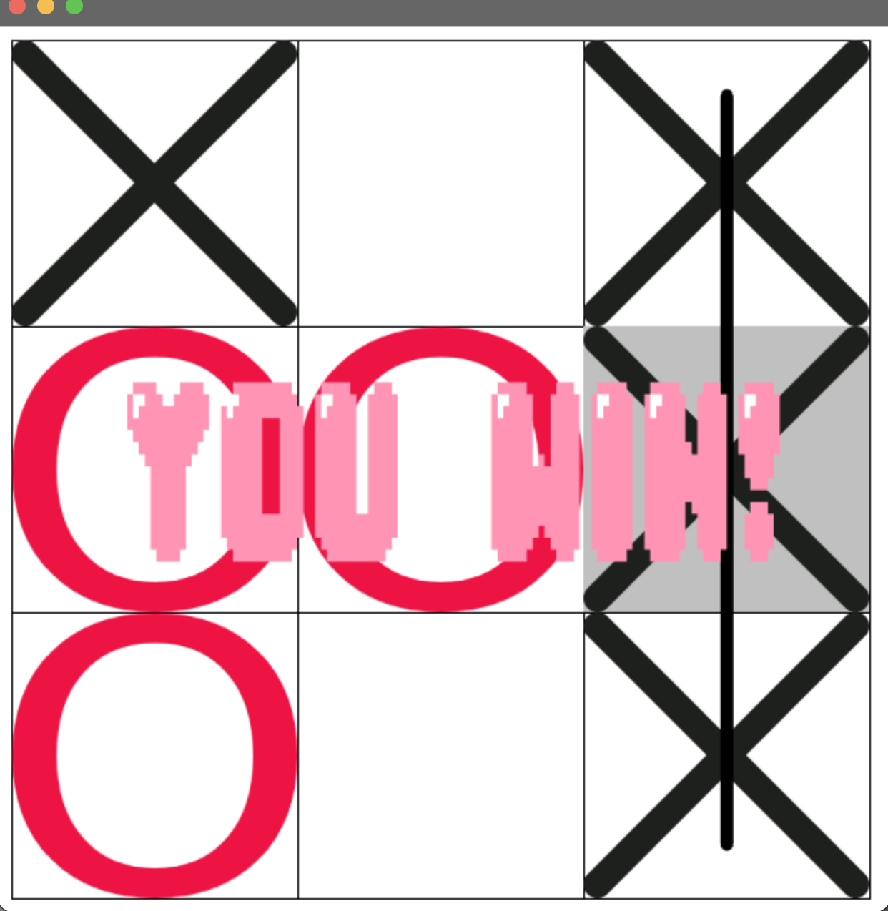
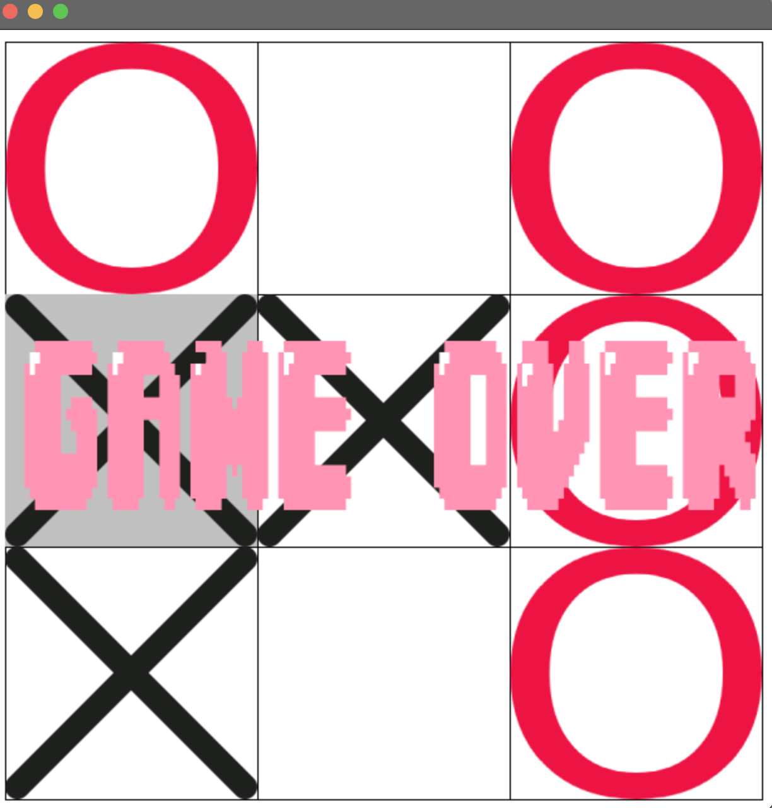

# TicTacToe

A networked 2-player Tic-Tac-Toe game built in Java with a client-server architecture, custom graphics, and sound effects.

## Screenshots

**Gameplay**


**You Win**


**Game Over**


## How It Works

The game is split into two separate applications — a **Server** and a **Client**:

- The **Server** listens on port `9900` and waits for two players to connect
- Each **Client** connects to the server via TCP socket and represents one player
- Once **two clients are connected**, the server assigns Player 1 (X) and Player 2 (O) and the game begins
- All moves are sent through the server, which broadcasts each move to the opponent
- The game runs locally by connecting both clients to `localhost`

## Features

- **Client-server networking** — two players connect via TCP sockets on port 9900
- **Custom graphics** — X/O symbols, win lines (horizontal, vertical, diagonal), win and game-over screens
- **Sound effects** — win sound played on victory
- **Keyboard controls** — players move a cursor and place their symbol
- **Game rules engine** — detects wins (rows, columns, diagonals) and draws

## Tech Stack

| | |
|---|---|
| Language | Java |
| Networking | Java Sockets (TCP) |
| Graphics | SimpleGraphics library |
| Audio | `javax.sound.sampled` |
| Build | Ant (`build.xml`) |
| IDE | IntelliJ IDEA |

## Project Structure

```
tictactoe/
├── ClientApp/
│   ├── src/org/academiadecodigo/loopeytunes/tictactoe/
│   │   ├── Client.java        # Entry point — connects to server
│   │   ├── Connection.java    # TCP client socket handling
│   │   ├── Field.java         # Game board rendering
│   │   ├── Cursor.java        # Player cursor movement
│   │   ├── GameKeyboard.java  # Keyboard input handler
│   │   ├── GameRules.java     # Win/draw detection
│   │   ├── Position.java      # Board position model
│   │   └── Sound.java         # Sound effect playback
│   ├── resources/             # Images and audio assets
│   └── lib/
│       └── simplegraphics.jar
└── ServerApp/
    ├── src/org/academiadecodigo/loopeytunes/tictactoe/
    │   ├── Server.java            # Entry point — listens on port 9900
    │   └── ServerConnection.java  # Manages player connections and broadcasts moves
    └── build.xml
```

## Setup

### Prerequisites

- Java 8+

### 1. Clone the repo

```bash
git clone git@github.com:jovbcorreia/tictactoe.git
cd tictactoe
```

### 2. Compile the Server

```bash
cd ServerApp
mkdir -p build/classes
javac -d build/classes $(find src -name "*.java")
```

### 3. Compile the Client

```bash
cd ../ClientApp
mkdir -p build/classes
javac -cp lib/simplegraphics.jar -d build/classes $(find src -name "*.java")
```

### 4. Start the Server

Open a terminal and run:

```bash
cd ServerApp
java -cp build/classes org.academiadecodigo.loopeytunes.tictactoe.Server
```

The server will start listening on port `9900`.

### 5. Start two Clients

Open **two separate terminals**, both inside `ClientApp/`, and run:

```bash
cd ClientApp
java -cp "build/classes:lib/simplegraphics.jar" org.academiadecodigo.loopeytunes.tictactoe.Client localhost
```

> Both clients must connect to the same address. Use `localhost` to play on the same machine, or replace with the server's local IP to play over a network.

The game starts automatically once both clients are connected.

## How to Play

| Action | Key |
|--------|-----|
| Move cursor | Arrow keys |
| Place symbol | Enter |

- Player 1 plays as **X**, Player 2 plays as **O**
- First to get 3 in a row (horizontal, vertical, or diagonal) wins
- If all 9 squares are filled with no winner, it's a draw

## Contributors

This was a group project developed by 4 students:

| Name | GitHub |
|------|--------|
| João Vilas-Boas Correia | [@jovbcorreia](https://github.com/jovbcorreia) |
| Jorge Tavares | — |
| Miguel Morais | — |
| Tiago Moreira | — |
